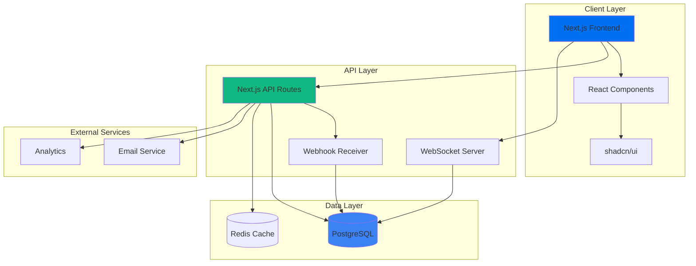

  
# 🪝 WebhookStudio

### The Modern Webhook Testing Platform

**Debug, test, and monitor webhooks with a beautiful interface**

[Demo](https://webhookstudio.dev) · [Documentation](https://docs.webhookstudio.dev) · [Report Bug](https://github.com/salgue441/webhookstudio/issues) · [Request Feature](https://github.com/salgue441/webhookstudio/issues)

---

## ✨ Features

<table>
  <tr>
    <td>
      <h3>🎯 Instant Webhook URLs</h3>
      
Get a unique, persistent URL in seconds. No signup required for testing.

    </td>
    <td>
      <h3>📊 Beautiful Request Inspector</h3>
      
View headers, body, and metadata with syntax highlighting and search.

    </td>
  </tr>
  <tr>
    <td>
      <h3>🔄 Replay & Transform</h3>
      
Resend webhooks with modifications to test edge cases and error handling.

    </td>
    <td>
      <h3>⚡ Real-time Updates</h3>
      
See webhooks arrive instantly with WebSocket-powered live updates.

    </td>
  </tr>
  <tr>
    <td>
      <h3>🎭 Mock Endpoints</h3>
      
Create fake webhook endpoints with custom responses for frontend testing.

    </td>
    <td>
      <h3>👥 Team Collaboration</h3>
      
Share webhook logs securely with temporary, password-protected links.

    </td>
  </tr>
</table>

---

## 🏗️ Architecture

